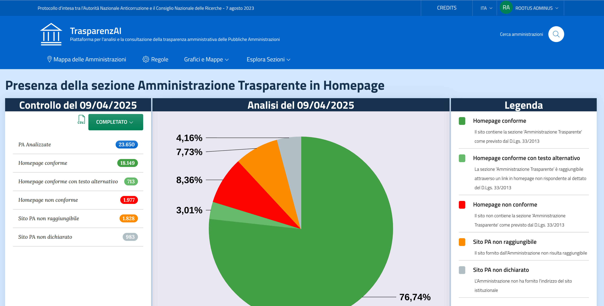

# UI - Service

[](../main/LICENSE)
[](../../pkgs/container/ui-service)
[](https://github.com/TrasparenzAI/ui-service/actions/workflows/build.yml)
[](https://angular.dev/)
[](https://getbootstrap.com/)

## Introduzione
UI Service è parte della suite di servizi per la verifica delle informazioni sulla Trasparenza dei siti web delle Pubbliche amministrazioni italiane.
Integra e mostra i dati presenti nei vari servizi fornendo la possibilità, avendo gli opportuni permessi, di attivare le funzionalità preposte all'inserimento e alla cancellazione degli stessi, inoltre è possibile attivare l'autenticazione su tutte le pagine, o in alternativa di accedere senza autenticazione per la sola consultazione dei dati per poi richiederla successivamente.  



# Indice

- [Dipendenze principali](#dipendenze-principali)
- [Variabili di Ambiente](#variabili-di-ambiente)
- [Autorizzazioni](#autorizzazioni)
- [Come installare](#come-installare)
- [Docker](#docker)
- [Come contribuire](#come-contribuire)
- [Licenza](#licenza)

## Dipendenze principali
| Nome                                                              | Versione |
|-------------------------------------------------------------------|----------|
| [Angular](https://angular.dev/)                                   | 20.0.4   |
| [Amcharts5](https://www.amcharts.com/)                            | 5.12.1   |
| [Leaflet](https://leafletjs.com/)                                 | 1.9.4    |
| [d3-org-chart](https://github.com/bumbeishvili/org-chart)         | 3.1.1    |
| [bootstrap-italia](https://italia.github.io/bootstrap-italia/)    | 2.16.0   |
| [Design Angular Kit](https://italia.github.io/design-angular-kit) | 2.0.0    |

## Variabili di Ambiente

| Nome                       | Valore di default                  | Descrizione                                                                                            |
|----------------------------|------------------------------------|--------------------------------------------------------------------------------------------------------|
| BASE_HREF                  | /                                  | URL di base da usare per tutti i link relativi                                                         |
| API_URL                    | https://dica33.ba.cnr.it           | URL di riferimento dei servizi                                                                         |
| COMPANY_API_URL            | $API_URL/public-sites-service      | URL del servizio [public-sites-service](https://github.com/TrasparenzAI/public-sites-service)          |
| CONDUCTOR_API_URL          | $API_URL/conductor-server          | URL del servizio [conductor-service](https://github.com/TrasparenzAI/conductor)                        |
| RESULT_API_URL             | $API_URL/result-service            | URL del servizio [result-service](https://github.com/TrasparenzAI/result-service)                      |
| RESULT_AGGREGATOR_API_URL  | $API_URL/result-aggregator-service | URL del servizio [result-aggregator-service](https://github.com/TrasparenzAI/result-aggregator-service)|
| TASK_SCHEDULER_API_URL     | $API_URL/task-scheduler-service    | URL del servizio [task-scheduler-service](https://github.com/TrasparenzAI/task-scheduler-service)      |
| RULE_API_URL               | $API_URL/rule-service              | URL del servizio [rule-service](https://github.com/TrasparenzAI/rule-service)                          |
| CRAWLER_API_URL            | $API_URL/crawl                     | URL del servizio [crawler-service](https://github.com/TrasparenzAI/crawler-service)                    |
| OIDC_ENABLE                | false                              | Parametro che indica se è attiva l'autenticazione tramite protocollo basato su OAuth 2.0               |
| OIDC_FORCE                 | false                              | Parametro che indica se l'autenticazione viene forzata su tutte le pagine                              |
| OIDC_AUTHORITY             |                                    | URL del servizio authority di norma è nella forma ```.../.well-known/openid-configuration```           |
| OIDC_REDIRECTURL           | http://localhost/auth/signin       | URL necessiaria per il redirect dopo l'accesso                                                         |
| OIDC_CLIENTID              | angular-public                     | Identificativo del client da usare, va impostato sul sistema di autenticazione                         |
| OIDC_POSTLOGOUTREDIRECTURL |                                    | URL da utilizzare dopo aver effettuato il logout può essere anche vuoto                                |

## Autorizzazioni

Nella enumeration [role.enum.ts](src/app/auth/role.enum.ts) sono definiti i ruoli gestiti all'interno del servizio, il ruolo viene recuperato dal TOKEN JWT, nello specifico dai ruoli presenti all'interno dell'attributo **"realm_access"**:

```json
"realm_access": {
    "roles": [
      "ROLE_SUPERUSER",
      "default-roles-trasparenzai",
      "offline_access",
      "uma_authorization"
    ]
}
```

# Come installare

## 🐧 Installare npm su Linux
Il metodo consigliato è installare Node.js, che include anche npm.

✅ Metodo 1: Usare il gestore di pacchetti della distro
### Ubuntu/Debian
```bash
sudo apt update
sudo apt install nodejs npm
```
Verifica:

```bash
node -v
npm -v
```
### Fedora
```bash
sudo dnf install nodejs
```

### Arch Linux / Manjaro
```bash
sudo pacman -S nodejs npm
```

✅ Metodo 2: Usare Node Version Manager (nvm) – consigliato

- Installa nvm:

```bash
curl -o- https://raw.githubusercontent.com/nvm-sh/nvm/v0.39.7/install.sh | bash
```

- Chiudi e riapri il terminale, poi esegui:

```bash
nvm install --lts
nvm use --lts
```

- Verifica installazione:

```bash
node -v
npm -v
```

✅ Vantaggi: puoi gestire più versioni di Node.js!

## 🪟 Installare npm su Windows

### ✅ Metodo consigliato: Installer ufficiale di Node.js

- Vai su https://nodejs.org
- Scarica la versione LTS (Long Term Support)
- Esegui il file .msi e segui le istruzioni (assicura che sia selezionata l'opzione per installare anche npm)
- Una volta terminato, apri il terminale (cmd o PowerShell) e verifica:

```bash
node -v
npm -v
```

## Installare le dipendenze e avviare il servizio
Dopo aver installato npm si può procedere all'installazzione dei pacchetti definiti all'interno del file [package.json](package.json) con la seguente istruzione:

```bash
npm install
```

Dopo aver installato le dipendenze e modificato il file [env.js](src/assets/env.js) con i parametri corretti si può avviare il servizio con la seguente istruzione:

```bash
npm start
```

Verrà aperta un finestra del browser predefinito alla URL http://localhost:4200/#/

# 🐳 Docker

### Installazione
- Installa Docker Linux: Segui la guida su https://docs.docker.com/engine/install/
- Windows/Mac: Scarica Docker Desktop da https://www.docker.com/products/docker-desktop

Il servizio è dotato di un [Dockerfile](Dockerfile) e tramite [GitHub Action](.github/workflows/build.yml) pubblica le immagini su [ghcr.io](https://github.com/TrasparenzAI/ui-service/pkgs/container/ui-service).

Per avviare il servizio tramite docker, impostando correttamente le [variabili d'ambiente](#variabili-di-ambiente), basta eseguire la seguente istruzione:  

```bash
docker run -p 80:80 -e OIDC_ENABLE=true ghcr.io/cnr-anac/ui-service:latest
```
## 👏 Come Contribuire 

E' possibile contribuire a questo progetto utilizzando le modalità standard della comunità opensource 
(issue + pull request) e siamo grati alla comunità per ogni contribuito a correggere bug e miglioramenti.

## 📄 Licenza

UI Service è concesso in licenza GNU AFFERO GENERAL PUBLIC LICENSE, come si trova 
nel file [LICENSE][l].

[l]: LICENSE
